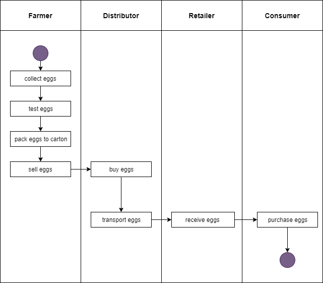
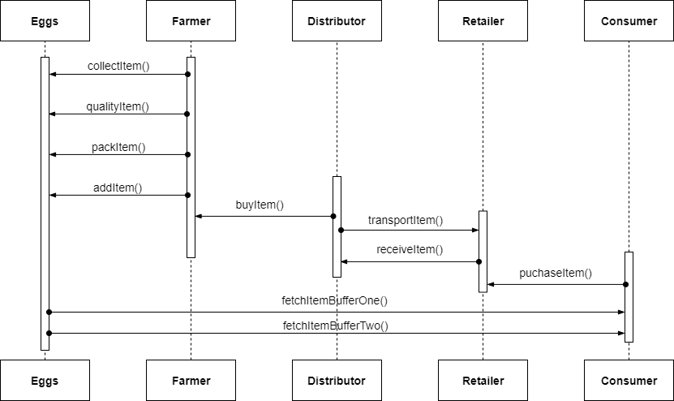
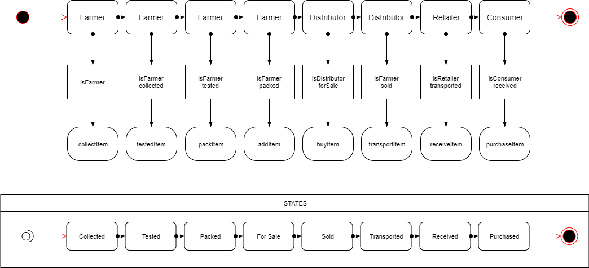
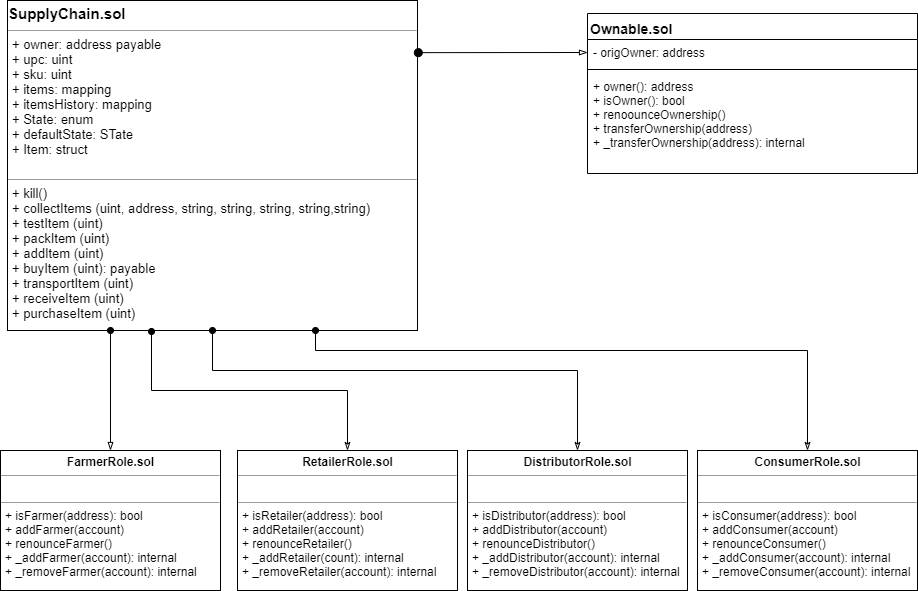

# Project 6B Supply Chain

## Truffle Version
>
    Truffle v5.0.41 
>

## Node Version
>
    node v10.16.3
>

## web3 Version
>
    v1.2.1
>
## Contract Address
>
    0x2ab32c59e4759e6d3ca04beb782198404f426dd4 
>

## From Project 6 A: Project write-up - UML

### Activity Diagram


### Sequence Diagram


### State Diagram



### Class Diagram (Data Model)



## Getting Started

These instructions will get you a copy of the project up and running on your local machine for development and testing purposes. See deployment for notes on how to deploy the project on a live system.

### Prerequisites

Please make sure you've already installed ganache-cli, Truffle and enabled MetaMask extension in your browser.

### Installing

A step by step series of examples that tell you have to get a development env running

Clone this repository:

```
git clone https://github.com/udacity/nd1309/tree/master/course-5/project-6
```

Change directory to ```project-6``` folder and install all requisite npm packages (as listed in ```package.json```):

```
cd project-6
npm install
```

Launch Ganache:

```
ganache-cli -m "marine waste meat ready empty false health alone shuffle globe auto good"
```

In a separate terminal window, Compile smart contracts:

```
truffle compile
```

This will create the smart contract artifacts in folder ```build\contracts```.

Migrate smart contracts to the locally running blockchain, ganache-cli:

```
truffle migrate
```

Test smart contracts:

```
truffle test
```

All 10 tests should pass.

In a separate terminal window, launch the DApp:

```
npm run dev
```
